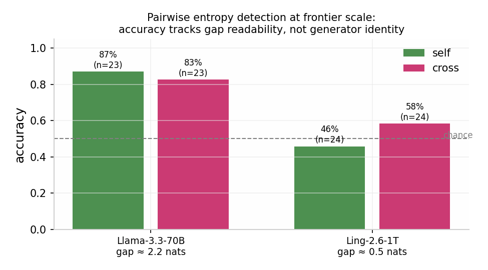
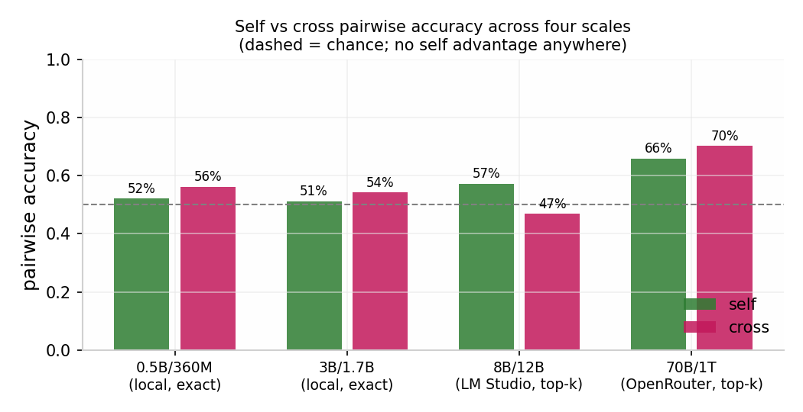

# Do language models know their own sampling entropy?

A controlled test of privileged introspective access, across four
scales and two elicitation paradigms.

**Short answer: no.** At no scale, with no paradigm, does a model's
estimate of its own sampling entropy beat what another model infers
from the same visible text. Everything the models get right is
readable from the output; nothing requires being the generator.

All trial-level data behind this document ships in
[`data/`](../data/) and recomputes every number below.

## 1. The question

When a model generates text by sampling from a probability
distribution, does it have access to information about that
distribution that is not present in the produced text? Specifically:
can a model estimate the entropy of its own sampling process better
than an outside observer reading the same answer?

The hypothesis is plausible. The distribution exists, in some sense,
inside the model before the text exists. If any of that information is
reportable, a model should judge its own entropy better than a peer
judging the same text. If the estimate is entirely reconstructible
from visible output, there is nothing privileged to report.

We test the narrow, falsifiable version: *verbalized* entropy
estimation, compared against a textual baseline.

## 2. Setup

### 2.1 Measurement

The ground truth is the Shannon entropy of the next-token distribution
at every generated position, averaged over the answer. Local runs
compute it exactly from full-vocabulary logits. Remote runs compute it
from the top-k logprobs returned by the API, renormalized; every
remote trial records the covered probability mass, and approximation
quality was high in practice (mean top-20 mass 0.99; worst accepted
trial 0.916).

### 2.2 Conditions

Each trial varies three factors:

- **Relation.** `self`: the model judges its own generation. `cross`:
  the other model judges it, seeing the same question and answer. The
  cross condition is the textual baseline; a self advantage only
  counts above it.
- **Timing.** `pre`: the judgment is requested before the answer
  exists. `post`: with the answer visible. (Absolute paradigm only.)
- **Temperature.** The sampling temperature is drawn per trial and
  never disclosed to the judge.

Model identity is hidden from the judge by default.

### 2.3 Paradigms

**Absolute.** The judge rates unpredictability on a 0-10 scale with
shared anchors. Endpoint: correlation between estimates and true
entropy per condition; the decisive test is the self-vs-cross
difference (Fisher z).

**Pairwise.** The judge sees two answers to the same question, one
generated at a low and one at a high hidden temperature, presentation
order randomized, and picks the more unpredictable one. The correct
answer is known objectively from the true entropies, so performance is
accuracy against 50% chance (exact binomial test). This paradigm has
an objective ground truth per judgment and is far more sensitive than
numeric estimation.

### 2.4 Scales

| Scale | Models | Engine |
|---|---|---|
| 0.5B / 360M | Qwen2.5-0.5B-Instruct, SmolLM2-360M-Instruct | local transformers, exact entropy |
| 3B / 1.7B | Qwen2.5-3B-Instruct, SmolLM2-1.7B-Instruct | local GGUF (llama.cpp), exact entropy |
| 8B / 12B | Hermes-3-Llama-3.1-8B, Mistral-Nemo-12B | LM Studio, top-k logprobs |
| 70B / 1T | Llama-3.3-70B, Ling-2.6-1T (MoE) | OpenRouter, top-k logprobs |

## 3. Results

### 3.1 Absolute paradigm, 0.5B (240 trials)

The self correlation between verbalized estimate and true entropy is
*negative* in the post condition (r = -0.27, p = 0.039), and the
self-vs-cross difference is significant in the wrong direction
(Fisher z p = 0.017). Estimates also compress onto a few integers,
showing that small models cannot use the numeric scale. This motivated
the pairwise paradigm.

### 3.2 Pairwise paradigm, small scales (96 judgments each)

| Scale | self | cross | self vs cross |
|---|---|---|---|
| 0.5B / 360M | 52.1% | 56.2% | n.s. |
| 3B / 1.7B | 51.2% (p = 1.0) | 54.2% (p = 0.67) | n.s. |

Both at chance, with a strong position bias (judges default to answer
"A" when unsure) and an unexpected pattern: accuracy is *worse* on
larger entropy gaps. Section 4.2 analyzes this.

### 3.3 Remote 8B/12B, absolute paradigm (192 trials)

At this scale a real correlation appears, but identically in both
conditions: self|post r = 0.509 (p = 1.6e-4), cross|post r = 0.538
(p = 5.6e-5); difference z = -0.18, p = 0.85. In the pre condition
nothing correlates (self r = 0.24, cross r = 0.03; difference
p = 0.31). The models *can* track entropy at 8-12B, unlike at 0.5B,
but they do it from the text: the same information is available to the
peer. Approximation quality: top-k mass 0.916-1.0 per trial.

### 3.4 Remote 8B/12B, pairwise (192 judgments)

self 57.3% (p = 0.18), cross 46.9% (p = 0.61); difference z = 1.44,
p = 0.15. Not significant. Temperature extremes of 0.2/2.0 produced
small gaps anyway (median 0.24 nats): these models stay confident even
at high temperature. The cross condition again shows extreme position
bias: 28.9% accuracy when the high-entropy answer is in position B.

### 3.5 Frontier 70B/1T, pairwise (96 judgments, 94 valid)

This run finally produced large, readable gaps (median 0.74 nats).
Pooled: self 66.7% (p = 0.029), cross 70.8% (p = 0.006); difference
z = -0.44, p = 0.66.

The per-generator breakdown is the clearest result of the study
(Figure 1): on Llama's large gaps (~2.2 nats) both conditions detect
the entropy (self 87%, cross 83%); on Ling's small gaps (~0.5 nats)
both sit at chance (self 46%, cross 58%). Detection accuracy tracks
how readable the gap is in the text, not who generated it. The
introspection hypothesis makes its strongest prediction exactly where
the text is silent; there, self is at chance.

### 3.6 Summary across scales

| Scale | Paradigm | Decisive comparison |
|---|---|---|
| 0.5B | absolute | self < cross, p = 0.017 (wrong direction) |
| 0.5B | pairwise | n.s. |
| 3B | pairwise | n.s. |
| 8-12B | absolute | z = -0.18, p = 0.85 |
| 8-12B | pairwise | z = 1.44, p = 0.15 |
| 70B/1T | pairwise | z = -0.44, p = 0.66 |

## 4. Secondary findings

### 4.1 Textual calibration emerges with scale

0.5B models cannot track entropy even from visible text (the self
correlation is negative). At 8-12B, both models track it well from
text (r ≈ 0.5, p ≈ 1e-4). The capability exists and scales, but it is
a reading capability, not an internal one.

### 4.2 Gradient inversion

At small scales, judges were *less* accurate on larger entropy gaps
(e.g. cross 71% on small gaps, 38% on large). The cause: large gaps
come from degenerate, broken high-temperature text, and judges read
broken text as defective, not unpredictable. On degenerate pairs cross
accuracy was 11% vs 64% on clean pairs. Re-judging with a prompt that
defines broken text as the signature of maximum randomness moved
cross/degenerate from 11% to 56%, and collapsed the self model's 100%
on its own degenerate answers to 50%: the apparent self advantage was
a heuristic about text quality, not introspection.

### 4.3 Position bias

In every environment, uncertain judges prefer whichever answer is
presented first ("A"). Worst case observed: 63% vs 29% accuracy by
presentation order. Any LLM-judge evaluation that does not randomize
presentation order inherits this bias; order randomization here is
what makes the chance baseline interpretable.

### 4.4 A cautionary tale about power

The first remote pairwise run (n = 48 per condition) gave self 68.75%
against chance, p = 0.013: a promising positive. Doubling the sample
under the same protocol gave 57%, p = 0.18. The positive was a
small-sample fluctuation. Every number reported in this document comes
from the larger samples.

## 5. Limitations

- Sample sizes per cell are modest (n = 23-96), especially at frontier
  scale, where API cost was the constraint.
- Entropy is manipulated through temperature, which also degrades
  text. The two are not fully separable; section 4.2 is precisely
  about this confound.
- Remote entropy is a top-k approximation. It is audited per trial and
  coverage was ~0.99, but it is not the exact full-vocabulary quantity
  used locally.
- The 8-12B and frontier models were quantized builds served by third
  parties; results may differ for full-precision weights.
- Verbalized estimation is a narrow channel. This study says nothing
  about other forms of self-knowledge (see section 6).

## 6. Related work

Verbalized uncertainty has been studied as a calibration problem:
Tian et al. (2023, "Just ask for calibration") and Lin et al. (2022,
"Teaching models to express uncertainty in words") show that simply
asking models for confidence can be competitive with logit-based
scores at large scale; Kadavath et al. (2022) showed models can
self-evaluate answer correctness. Our setup differs in the quantity
asked for: not confidence in being right, but the entropy of the
sampling process itself, with an objective per-trial ground truth.

On introspection proper, recent work reports genuine self-knowledge in
frontier models (e.g. Binder et al., 2025, "Looking inward", and
related work on activation-level self-report). Our claim is narrower
and compatible with those results: whatever privileged access may
exist, it does not surface as a usable verbal estimate of sampling
entropy, at any scale we tested, beyond what the text already reveals.

## 7. Data and reproducibility

Every number here recomputes from [`data/`](../data/), which contains
the full trial records (prompts' parameters, temperatures, entropies,
estimates, judgments) for all four scales. The lab that produced them
is this repository; remote runs are configurable through `.env` and
require only an OpenAI-compatible endpoint. Figures are generated from
the published JSON files.
